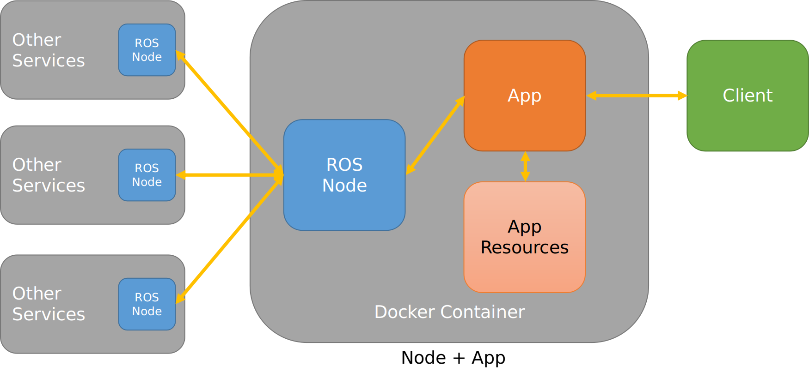
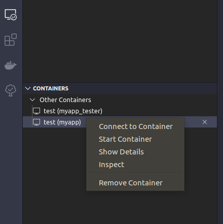

# Data Management

* [Design/Architecture](#designarchitecture)
    * [System Architecture](#system-architecture)
    * [ROS Node+App Architecture](#ros-node-app-architecture)
    * [Dependencies](#dependencies)
* [Building the Apps/Services](#building-the-appsservices)
    * [Building the sample *ros-base*](#building-the-sample-ros-base)
    * [Building your own apps/services](#building-your-own-appsservices)
* [Runing the Apps/Services](#running-the-appsservices)
    * [Running the sample *ros-base*](#running-the-sample-ros-base)
    * [Running your own apps/services](#running-your-own-appsservices)
* [Development](#development)
    * [Using Visual Studio Code](#using-visual-studio-code)
    * [TODO](#todo)
* [References](#references)

## Design/Architecture

### System Architecture

TBD

### ROS Node + App Architecture



### Dependencies

* Host Machine
    * Docker 19.x
    * docker-compose 1.24.x
* ROS Docker Image
    * [osrf/ros2:nightly](https://hub.docker.com/layers/osrf/ros2/nightly/images/sha256-6776bc1367b7248a709cf3d13559cc33ee2b693415382dee1f89429e141a2aa7)
    * [ROS 2 Eloquent](https://index.ros.org/doc/ros2/Releases/Release-Eloquent-Elusor/)
    * Python 3.7.3
    * CMake 3.10.x

## Building the Apps/Services

### Building the sample *ros-base*

```shell
$ docker build \
    --file config/ros-base.dockerfile \
    --tag <registry>/ros-base:latest \
    .

```
* `<registry>` is the URL of a remote/local registry, or blank

Sample Build Output

```none
...
Step 14/25 : RUN tree -L 3 ${WS}
---> Running in 2428ebe13532
/ws/ros-base
├── myapp
│   ├── myapp
│   │   ├── __init__.py
│   │   ├── app.py
│   │   └── app_node.py
│   ├── package.xml
│   └── setup.py
├── myapp_apis
│   ├── CMakeLists.txt
│   ├── msg
│   │   ├── AppCommand.msg
│   │   └── AppData.msg
│   ├── package.xml
│   └── srv
│       └── GetAppData.srv
├── myapp_tester
│   ├── myapp_tester
│   │   ├── __init__.py
│   │   └── test_node.py
│   ├── package.xml
│   └── setup.py
├── requirements.txt
└── run-node.sh
...
Step 21/25 : RUN /bin/bash -c "source /opt/ros/eloquent/setup.bash; colcon build;"
---> Running in 704465103ad2
Starting >>> myapp
Starting >>> myapp_apis
Starting >>> myapp_tester
Finished <<< myapp [1.71s]
Finished <<< myapp_tester [1.95s]
Finished <<< myapp_apis [8.60s]
Summary: 3 packages finished [9.14s]
...
```

### Building your own apps/services

1. Create the node+app under the *src* directory
1. Create the node+app *.dockerfile* under the *config* directory
1. Build the Docker image
    ```shell
    $ docker build \
        --file config/<target>.dockerfile \
        --tag <registry>/ros-base:<version> \
        .

    ```
    * `<registry>` is the URL of a remote/local registry, or blank
    * `<version>` is the [semantic versioning](https://semver.org/) of the app

## Running the Apps/Services

### Running the sample *ros-base*

```shell
$ docker-compose --file test/ros-base.yml up

```

Sample Run Output:

```none
Creating myapp_tester ... done
Creating myapp        ... done
Attaching to myapp_tester, myapp
myapp           | APP is UP.
myapp_tester    | APP_TESTER is UP.
myapp_tester    | APP_TESTER will send 5 msgs
myapp_tester    | APP_TESTER sent: x=12.0,y=23.0,z=39.0
myapp_tester    | APP_TESTER sent: action=hello!
myapp_tester    | APP_TESTER requested for user_id=5
myapp           | APP received: x=12.0,y=23.0,z=39.0,action=hello!
myapp           | APP applied command with params x=12.0,y=23.0,z=39.0,action=hello!
myapp           | APP is getting data for user=5
myapp_tester    | APP_TESTER sent: x=16.0,y=22.0,z=38.0
myapp_tester    | APP_TESTER sent: action=hello!
myapp_tester    | APP_TESTER requested for user_id=4
myapp_tester    | APP TESTER received: x=3.0, y=7.0, z=12.0
myapp           | APP received: x=16.0,y=22.0,z=38.0,action=hello!
myapp           | APP applied command with params x=16.0,y=22.0,z=38.0,action=hello!
myapp           | APP is getting data for user=4

```

### Running your own apps/services

1. Create the node+app docker-compose *.yml* file under the *test* directory
1. Run
    ```shell
    $ docker-compose --file test/<target>.yml up

    ```
1. When finished, make sure to `down` the containers.
    ```shell
    $ docker-compose --file test/<target>.yml down

    ```

## Development

In the current structure, the nodes and apps are `COPY`-ed over to the Docker container, and compiled/built *also* inside a container. To modify the codes for the nodes and the apps, one option is to run an interactive Docker container, modify the codes directly, then `commit` a new image with a new version.

```none
# --- from the host machine ---
$ docker run \
    -it \
    --name myapp \
    192.168.1.65:5006/ros-base:0.0.1 \
    /bin/bash

# --- inside the myapp container ---
$ vi myapp/myapp/app.py
$ colcon build
$ myapp_node &
$ myapp_tester &
# ..verify that the app is working..
$ exit

# --- back in the host machine ---
$ docker commit \
    -m "Fixed request/response" \
    myapp \
    192.168.1.65:5006/ros-base:0.0.2

```

This approach is problematic if you also need to commit the modified codes to a git repository. In this case, you'll have to copy the modified codes *from* the container *to* your host machine holding the git repo. A possible workaround to that is to `git clone` the codes inside the container. That *could* work, but then you'll have to setup `git` inside the container, then copy and store your private SSH keys to access the repo from inside the container (so it would be shareable as an image).

A better option is to create a container from the Docker image with a [mounted directory](https://docs.docker.com/storage/bind-mounts/) from the host machine. This would put a copy of the version-controlled codes inside the container (replacing the original from the image), and then allow you to commit the changes afterwards.

```none
# --- from the host machine ---
$ docker run \
    -it \
    --name myapp \
    -v /path/to/repo/src/ros-base:/ws/ros-base \
    192.168.1.65:5006/ros-base:0.0.2

# --- inside the myapp container ---
$ vi myapp/myapp/app.py
$ colcon build
$ myapp_node &
$ myapp_tester &
# ..verify that the app is working..
$ exit

# --- back in the host machine ---
$ docker build config/myapp.dockerfile ...  # rebuild a new version
$ git commit ...                            # commit the modified codes
```

If you are using Visual Studio Code, check the [Using Visual Studio Code](#using-visual-studio-code) section on how to edit the codes inside the container directly from your editor.

Note that we reuse the *.dockerfile* to rebuild the image. It is possible just use `docker commit` on the container, but then the new image would now expect you to always `mount` the codes every time you run it in a container. Also, by reusing the *.dockerfile*, we ensure that we can check that we rebuild the modified image from scratch every time.

### Using Visual Studio Code

* When [mounting](https://docs.docker.com/storage/bind-mounts/) the codes from the host machine into the Docker container, you can use VS Code's [Docker](https://marketplace.visualstudio.com/items?itemName=ms-azuretools.vscode-docker) and [Remote Development](https://marketplace.visualstudio.com/items?itemName=ms-vscode-remote.vscode-remote-extensionpack) extensions to connect to the Docker container and edit the codes directly from the IDE.
    1. Install the extensions
    1. From the *Docker* panel, run a container from the app image
    1. From the *Remote Explorer* panel, find your running container and connect to it

        

* Linting for Python files
    * You'll need to point the Python intellisense and linter engines to the built site-packages:
    * Update *settings.json* inside *.vscode*:
        ```json
        "python.autoComplete.extraPaths": [
            "/opt/ros/eloquent/lib/python3.6/site-packages/",
            "/path/to/host/src/ros-base/install/myapp_apis/lib/python3.6/site-packages"
        ]

        ```
    * Create a *.env* at the root of the project (or wherever the setting `python.envFile` points to):
        ```env
        PYTHONPATH=$PYTHONPATH:/opt/ros/eloquent/lib/python3.6/site-packages/:/path/to/host/src/ros-base/install/myapp_apis/lib/python3.6/site-packages

        ```

### TODO

* ROS
    * Configure ROS to use Python3.7
    * Move services and topic names to *myapp_apis*
* Tools
    * Add VS Code workspace settings
* Docs
    * Change to PlantUML

## References

* Migration from ROS1 to ROS2
    * [Migration guide from ROS 1](https://index.ros.org/doc/ros2/Contributing/Migration-Guide/)
    * [Python Migration guide from ROS 1](https://index.ros.org/doc/ros2/Contributing/Migration-Guide-Python/)
* Samples/Tutorials
    * [demo_nodes_py](https://github.com/ros2/demos/tree/master/demo_nodes_py)
    * [ROS 2 Tutorials](http://docs.erlerobotics.com/robot_operating_system/ros2/tutorials)
* API
    * [ROS Interfaces](https://index.ros.org/doc/ros2/Concepts/About-ROS-Interfaces/)
    * [rclpy](https://github.com/ros2/rclpy/tree/master/rclpy/rclpy)
